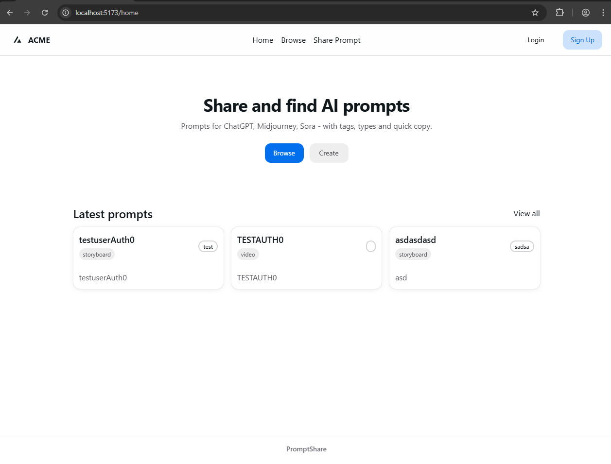
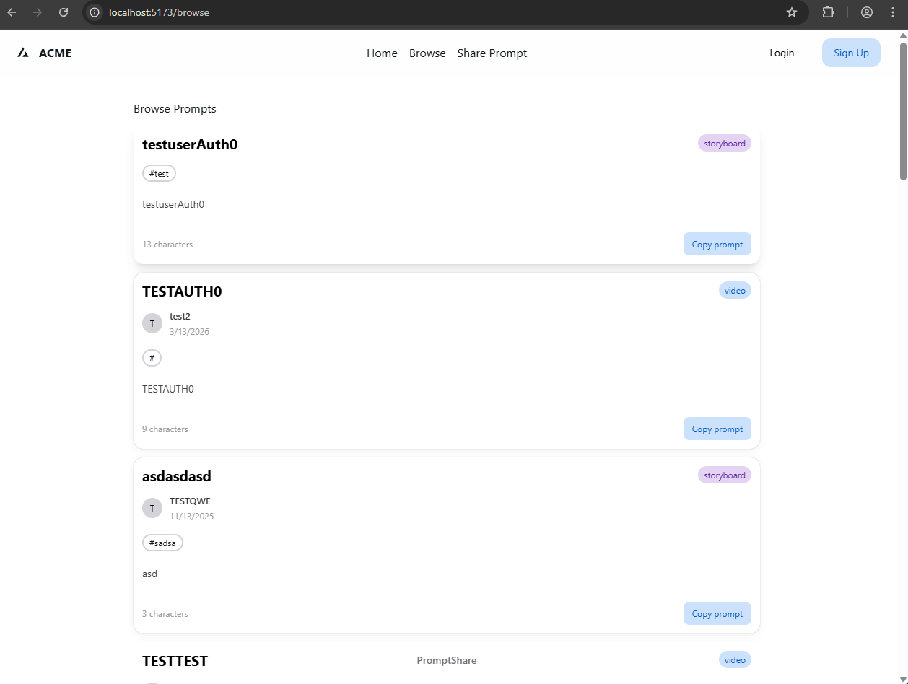
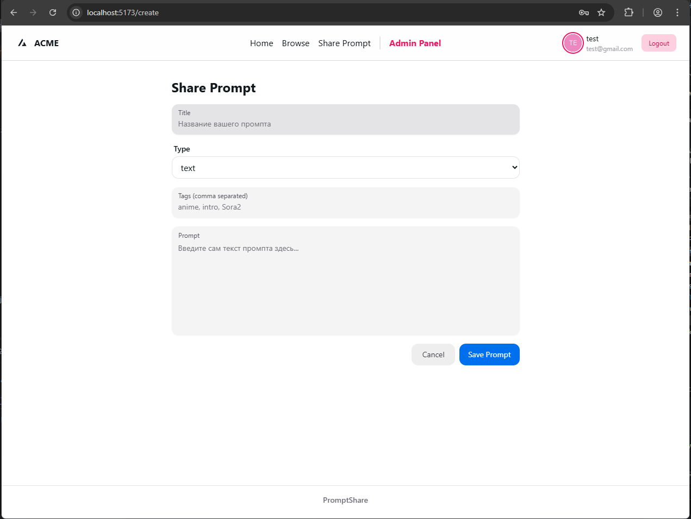
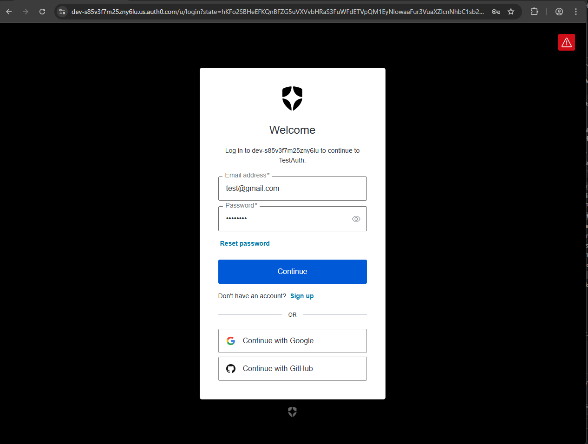
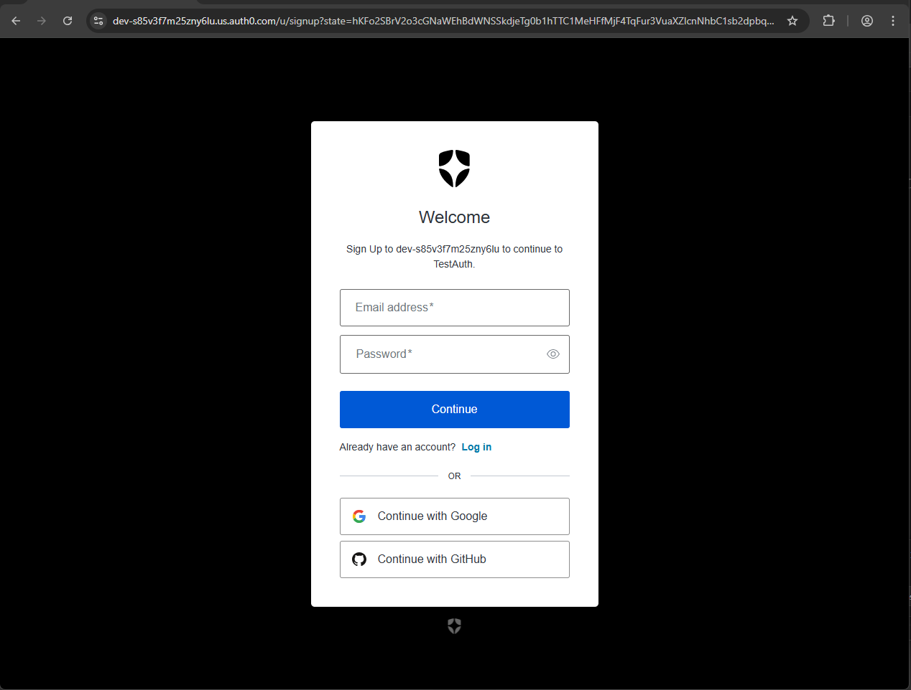
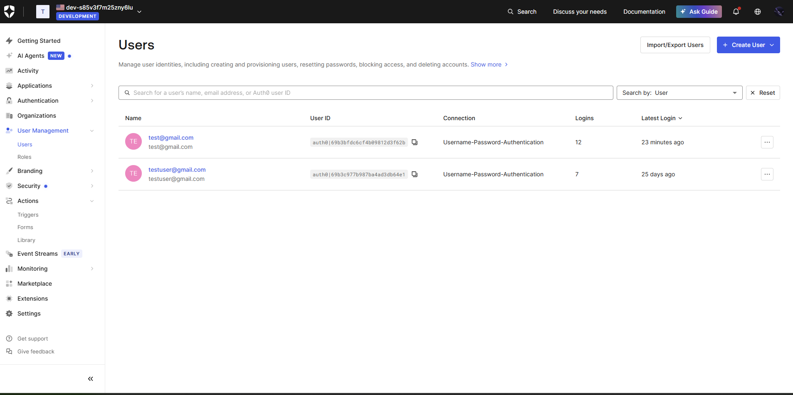
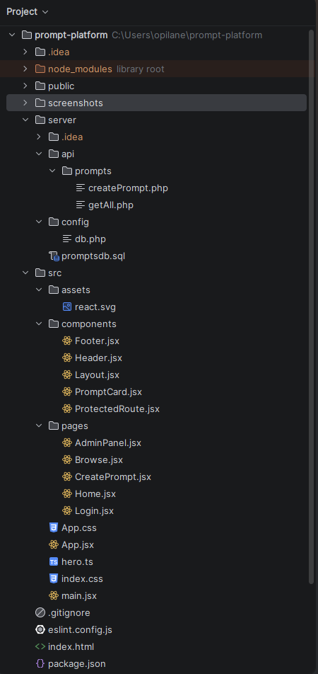

# Prompt Platform

A web application for sharing prompts, search for suitable prompts.

## Tech Stack

* Frontend: React, Vite, Tailwind CSS, Framer Motion, HeroUI
* Backend: PHP, MySQL
* Authentication: Auth0 

## Features

* Show a list of all prompts.
* Show a prompt by ID.
* Add a new prompt.
* Update a prompt.
* Delete a prompt.
* Show prompts by author.
* Show prompts by tag.
* Search prompts by title or content.
* Show all tags.
* Add a tag.
* Delete a tag.
* Show all users.
* Show a user by ID.
* Add a new user.
* Update user data.
* Delete a user.

## User Roles

Note that managing users and their roles is entirely done through the Auth0 website and dashboard.

### GUEST
* Can only view prompts and their details.
* Sees only public pages and the "Login" button.

### USER (ROLE_USER)
* Can create and edit their own prompts.
* Can view prompts and tags.

### ADMIN (ROLE_ADMIN)
* Has full access to everything: managing users, prompts, and tags.
* Can edit and delete any prompt, add or delete tags, and manage users.

## Screenshots

### Home

### Browse

### Create Prompt

### Login

### Sign-up

### Auth0 Dashboard

## Project Structure

### Server

* **API Prompts**
  * createPrompt.php
  * getAll.php
* **Config**
  * db.php
* **Database**
  * promptsdb.sql

### Client Source

* **Components**
  * Footer.jsx
  * Header.jsx
  * Layout.jsx
  * PromptCard.jsx
  * ProtectedRoute.jsx
* **Pages**
  * AdminPanel.jsx
  * Browse.jsx
  * CreatePrompt.jsx
  * Home.jsx
  * Login.jsx
* **Core**
  * App.jsx
  * main.jsx

### Root Files

* index.html
* package.json

## Getting Started

To run this project locally, follow these steps:

### 1. Clone the Repository

git clone https://github.com/DimaAllikvee/prompt-platform.git
cd prompt-platform

### 2. Database Setup

Create a MySQL database named promptsdb.
Import the SQL schema provided in server/promptsdb.sql to set up the necessary tables.
Ensure your MySQL credentials match the host, username (root), and password (empty) in server/config/db.php.

### 3. Backend Setup

You need to serve the server directory using a local web server running PHP. Common tools for Windows include XAMPP.

### 4. Frontend Setup

Open a new terminal in the root directory and install dependencies:

npm install

Start the Vite development server:

npm run dev

The web application can be accessed at http://localhost:5173/

### 5. How to Run

To build the frontend app for production:

npm run build